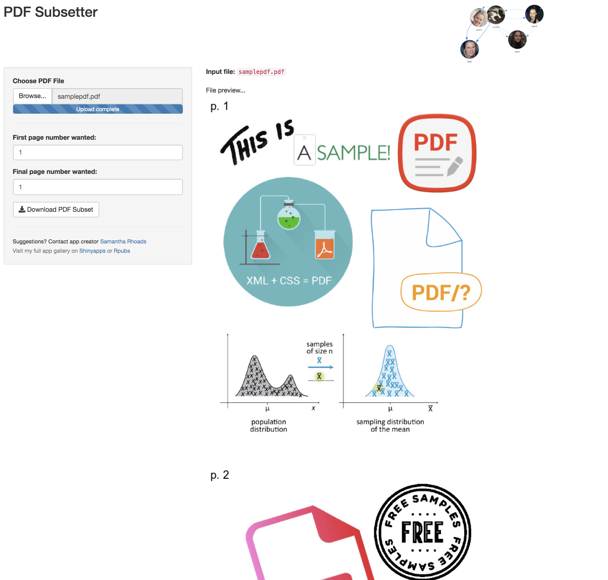
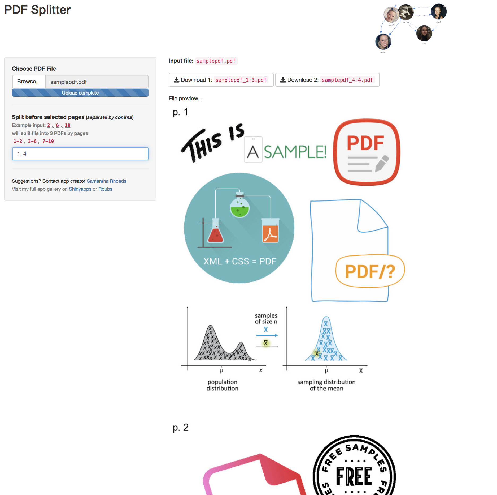
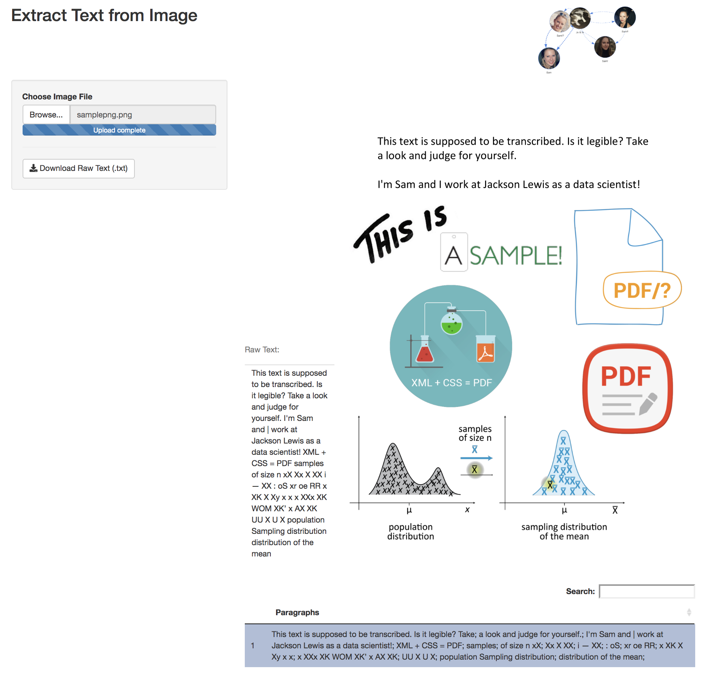
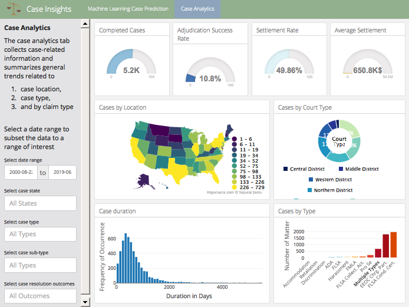
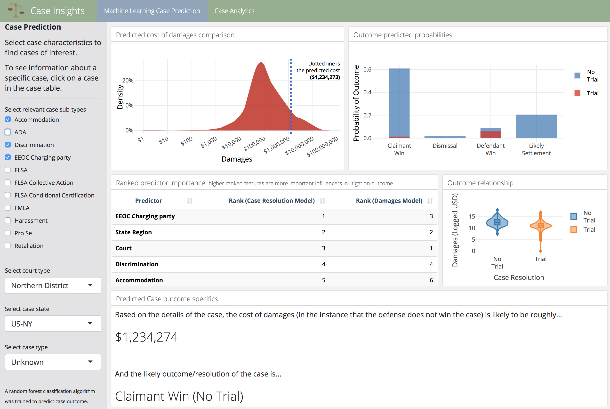
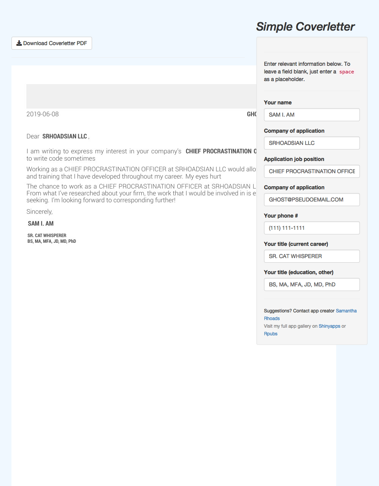
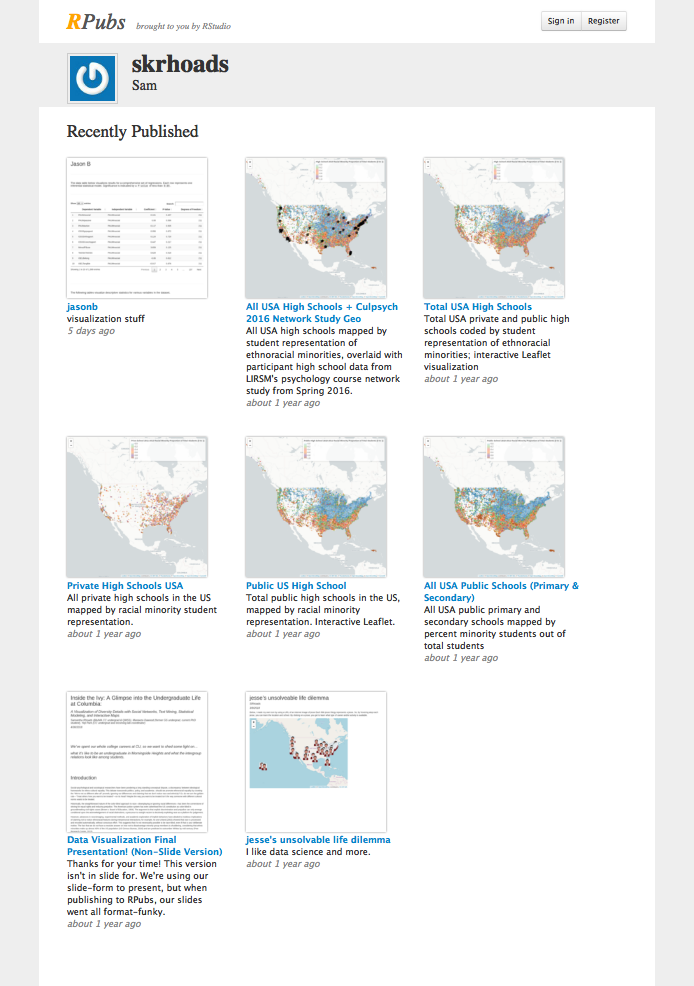
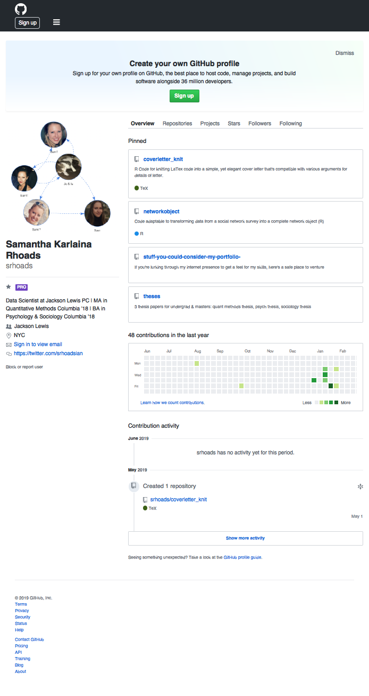
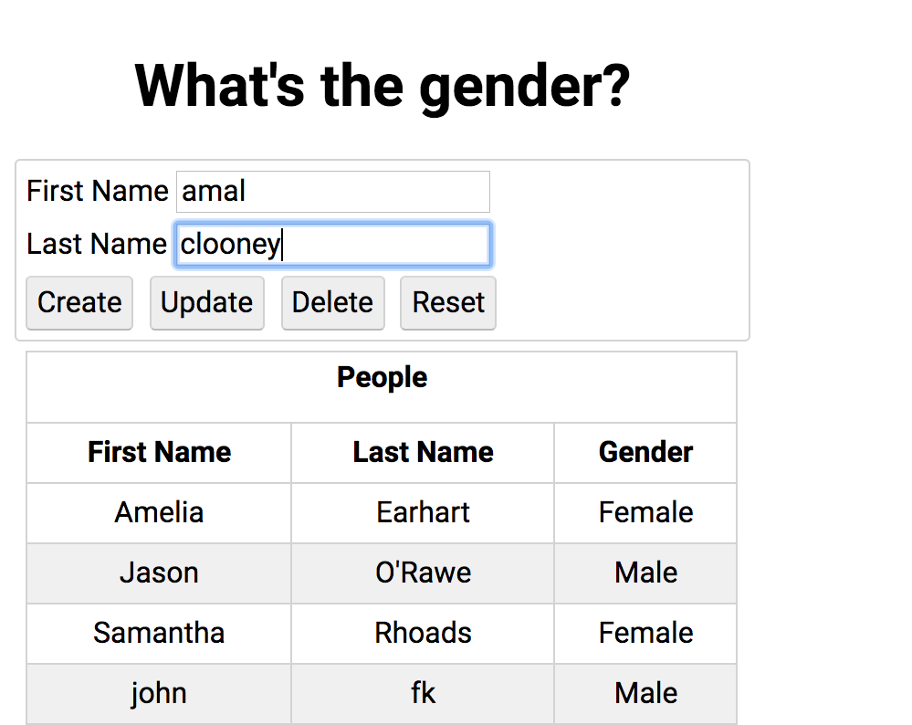

```{r setup, include=FALSE}
`%>%` <- magrittr::`%>%`
library(magick)
library(ggplot2)
library(plotly)
library(plyr)
library(shiny)
library(flexdashboard)
shinybaseurl_fxn <- function(shinyuser="srhoadsian") paste0("https://", shinyuser, ".shinyapps.io/")
soonimage <- 'https://indyme.com/wp-content/uploads/2016/04/coming-soon.png'
# dir.create("www")
# file.choose() %>% file.copy(., "logo.png")
# file.copy("logo.png", "www/logo.png")
# image_read("www/logo.png") %>%
#   # image_trim() %>%
#   # image_scale(., '75') %>%
#   image_resize(., geometry_size_pixels(85, 48, preserve_aspect = FALSE)) %>%
#   image_transparent(., "white", fuzz=3) %>%
#   image_write(., "logo.png")

# image_read('https://www.fawl.org/assets/LOGOS/jackson%20lewis%20no%20tag%20color%20png.png') %>%
#   image_scale(., '75') %>%
#   image_write(., "logos/jl45px.png")
```

```{r, eval=F}
# px <- '170'
# # image_read('https://www.fawl.org/assets/LOGOS/jackson%20lewis%20no%20tag%20color%20png.png') %>%
# #   image_scale(., px) %>%
# #   image_trim() %>%
# #   image_write(., paste0("logos/jl", px, "px.png"))
# 
# # (jllog <- image_read('http://www.urbanleagueneb.org/wp-content/uploads/2014/11/Jackson-Lewis.png') %>%
# #   image_scale(., px) %>%
# #   image_trim(., fuzz="10") %>%
# #   image_chop(., "1x1000")) %>%
# #   image_write(., paste0("logos/jl", px, "px.png"))
# 
# # (jllog <- image_read('http://ilgconference.com/2018/wp-content/uploads/2017/01/Jackson_Lewis.png') %>%
# #   image_scale(., px)) %>%
# #   # image_trim(., fuzz="10") %>%
# #   # image_chop(., "1x1000")) %>%
# #   image_write(., paste0("logos/jl", px, "px.png"))
# 
# # (jllog <- image_read('https://assets.classy.org/5677650/d69189b0-0adb-11e9-bdba-0e81d5c2eace.png') %>%
# #   image_scale(., px)) %>%
# #   # image_trim() %>%
# #   # image_chop(., "1x1000")) %>%
# #   image_crop(., "48x48+1") %>%
# #   image_write(., paste0("logos/jl", px, "px.png"))
# 
# (jllog <- image_read('http://ilgconference.com/2018/wp-content/uploads/2017/01/Jackson_Lewis.png') %>%
#     # image_scale(., px) %>%
#     # image_trim() %>%
#     # image_chop(., "1x1000")) %>%
#     image_crop(., "620x145+10+20") %>% # right, bottom, left, top
#     image_scale(., px)
# ) %>%
#   image_write(., paste0("logos/jl", px, "px.png"))
# jllog
# 
# 
# frink <- image_read("https://jeroen.github.io/images/frink.png") %>%
#   image_background(., "hotpink") %>% image_border(., "#000080", "20x10") %>% # 20 side edge; 10 top+bottom edges
#   image_crop(., "190x80+90+100") # 190=right; 80=bottom; 90 = left; 100=top
# frink

```

Projects
=======================================================================

Row
-----------------------------------------------------------------------

```{r, include=F}
projectname <- 'pdfsubsetter'
shinybaseurl <- 'https://srhoadsian.shinyapps.io/'
outputfile <- paste0(projectname, '.png')
weburl <- paste0(shinybaseurl, projectname, "/")
# webshot::webshot(weburl, outputfile, zoom = .7)
```

### `r a(href = weburl, projectname)`
[](`r weburl`)


<!-- ---------------------------------------------- NEXT ONE ---------------------------------------------- -->


```{r, include=F}
projectname <- 'pdfsplitter'
shinybaseurl <- 'https://srhoadsian.shinyapps.io/'
outputfile <- paste0(projectname, '.png')
weburl <- paste0(shinybaseurl, projectname, "/")
# webshot::webshot(weburl, outputfile, zoom = .7, delay=10)
```

### `r a(href = weburl, projectname)`
[](`r weburl`)


<!-- ---------------------------------------------- NEXT ONE ---------------------------------------------- -->


```{r, include=F}
projectname <- 'imagetotext'
shinybaseurl <- 'https://srhoadsian.shinyapps.io/'
outputfile <- paste0(projectname, '.png')
weburl <- paste0(shinybaseurl, projectname, "/")
# webshot::webshot(weburl, outputfile, zoom = .7, delay=10)
```

### `r a(href = weburl, projectname)`
[](`r weburl`)


<!-- ---------------------------------------------- NEXT ONE ---------------------------------------------- -->

Row
-----------------------------------------------------------------------


```{r, include=F}
projectname <- "litigationprediction" #'retail_litigation_prediction'
shinyuser <- "srhoads"
shinybaseurl <- shinybaseurl_fxn(shinyuser)
tab1 <- F
outputfile <- if(tab1) paste0(projectname, '.png') else paste0(projectname, '2.png')
weburl <- if(tab1) paste0(shinybaseurl, projectname, "/") else paste0(shinybaseurl, projectname, "/", "#section-case-analytics")
# webshot::webshot(weburl, outputfile, zoom = .7, delay="40")
```

### `r a(href = weburl, projectname %>% gsub(projectname, "litigation analytics", .))`
[](`r weburl`)


<!-- ---------------------------------------------- NEXT ONE ---------------------------------------------- -->


```{r, include=F}
projectname <- "litigationprediction" #'retail_litigation_prediction'
shinyuser <- "srhoads"
shinybaseurl <- shinybaseurl_fxn(shinyuser)
outputfile <- paste0(projectname, '.png')
weburl <- paste0(shinybaseurl, projectname, "/")
# webshot::webshot(weburl, outputfile, zoom = .7, delay="40")
# image_read('litigationprediction.png', density='80x80') %>%
#   # image_resize(., "35%") %>%
#   image_write(., "litigationprediction1.png")
```

### `r a(href = weburl, projectname)`
[](`r weburl`)


<!-- ---------------------------------------------- NEXT ONE ---------------------------------------------- -->


```{r, include=F}
projectname <- 'coverletter_simple'
shinybaseurl <- 'https://srhoadsian.shinyapps.io/'
outputfile <- paste0(projectname, '.png')
weburl <- paste0(shinybaseurl, projectname, "/")
# webshot::webshot(weburl, outputfile, zoom = .7,  delay=10)
```

### `r a(href = weburl, projectname %>% gsub("_", " ", .))`
[](`r weburl`)


More...
=======================================================================

Row
-----------------------------------------------------------------------


```{r, include=F}
projectname <- tolower('rpubs profile (html rendered reports)')
shinybaseurl <- 'https://rpubs.com/skrhoads'
weburl <- shinybaseurl
outputfile <- paste0("rpubs_skrhoads", '.png')
# webshot::webshot(weburl, outputfile, zoom = .7, delay=10)
```

### `r a(href = weburl, projectname)`
[](`r weburl`)


```{r, include=F}
projectname <- tolower('github')
shinybaseurl <- 'https://github.com/srhoads'
outputfile <- paste0(projectname, '.png')
weburl <- shinybaseurl
# webshot::webshot(weburl, outputfile, zoom = .7, delay=4)
```

### `r a(href = weburl, projectname)`
[](`r weburl`)


```{r, include=F}
projectname <- tolower('Word repetition (NLP)')
# shinybaseurl <- 'https://srhoadsian.shinyapps.io/'
outputfile <- paste0(projectname, '.png')
soonimage <- 'https://indyme.com/wp-content/uploads/2016/04/coming-soon.png'
# webshot::webshot(weburl, outputfile, zoom = .7)
```

### `r projectname`
[]()


Row
-----------------------------------------------------------------------


```{r, include=F}
projectname <- tolower(paste0('Gender Predictor by Name (Machine Learning)...', HTML(" <small>link coming soon</small>")))
# shinybaseurl <- 'https://srhoadsian.shinyapps.io/'
outputfile <- paste0(projectname, '.png')
# webshot::webshot(weburl, outputfile, zoom = .7)
# image_read("genderpredictor.png", density=80) %>%
#   image_trim() %>% 
#   image_crop(., "999x1400+360+80") %>% # _ _ l t
#   image_write("genderpredictor1.png")
```

### `r projectname`
[]()


```{r, include=F}
projectname <- tolower('USA Secondary Schools Leaflet Map')
# shinybaseurl <- 'https://srhoadsian.shinyapps.io/'
outputfile <- paste0(projectname, '.png')
soonimage <- 'https://indyme.com/wp-content/uploads/2016/04/coming-soon.png'
# webshot::webshot(weburl, outputfile, zoom = .7)
```

### `r projectname`
[]()


```{r, include=F}
projectname <- 'Coming soon...'
# shinybaseurl <- 'https://srhoadsian.shinyapps.io/'
outputfile <- paste0(projectname, '.png')
soonimage <- 'https://indyme.com/wp-content/uploads/2016/04/coming-soon.png'
# webshot::webshot(weburl, outputfile, zoom = .7)
```

### `r projectname`
[]()


<!-- ```{r, include=F} -->
<!-- projectname <- 'Coming soon...' -->
<!-- # shinybaseurl <- 'https://srhoadsian.shinyapps.io/' -->
<!-- outputfile <- paste0(projectname, '.png') -->
<!-- soonimage <- 'https://indyme.com/wp-content/uploads/2016/04/coming-soon.png' -->
<!-- # webshot::webshot(weburl, outputfile, zoom = .7) -->
<!-- ``` -->

<!-- ### `r projectname` -->
<!-- []() -->


<!-- ```{r, include=F} -->
<!-- projectname <- 'Coming soon...' -->
<!-- # shinybaseurl <- 'https://srhoadsian.shinyapps.io/' -->
<!-- outputfile <- paste0(projectname, '.png') -->
<!-- soonimage <- 'https://indyme.com/wp-content/uploads/2016/04/coming-soon.png' -->
<!-- # webshot::webshot(weburl, outputfile, zoom = .7) -->
<!-- ``` -->

<!-- ### `r projectname` -->
<!-- []() -->


<!-- https://srhoadsian.shinyapps.io/litigation/ -->


<!-- ```{r, include=F} -->
<!-- projectname <- 'litigation' -->
<!-- shinybaseurl <- 'https://srhoadsian.shinyapps.io/' -->
<!-- outputfile <- paste0(projectname, '.png') -->
<!-- weburl <- "https://srhoadsian.shinyapps.io/litigation/" #paste0(shinybaseurl, projectname, "/") -->
<!-- # webshot::webshot(weburl, outputfile, zoom = .7, delay="40") -->
<!-- # file.copy(outputfile, paste0("www/", outputfile)) -->
<!-- ## image_read(outputfile) -->
<!-- ``` -->

<!-- ### `r a(href = weburl, projectname)` -->
<!-- [](`r weburl`) -->


<!-- ---------------------------------------------- NEXT ONE ---------------------------------------------- -->


<!-- ```{r, include=F} -->
<!-- #https://srhoadsian.shinyapps.io/lawmap/ -->
<!-- projectname <- 'lawmap' -->
<!-- shinybaseurl <- 'https://srhoadsian.shinyapps.io/' -->
<!-- outputfile <- paste0(projectname, '.png') -->
<!-- weburl <- "https://srhoadsian.shinyapps.io/lawmap/" #paste0(shinybaseurl, projectname, "/") -->
<!-- # webshot::webshot(weburl, outputfile, zoom = .7, delay=20) -->
<!-- # image_read(outputfile) -->
<!-- ``` -->

<!-- ### `r a(href = weburl, projectname)` -->
<!-- [](`r weburl`) -->


<!-- Client Projects -->
<!-- ======================================================================= -->

<!-- Row  -->
<!-- ----------------------------------------------------------------------- -->


<!-- ### `r textInput("sanofi", "Sanofi Password (Type & Press Enter for Dashboard Link)", width="110%")` -->

<!-- ```{r, context="data"} -->
<!-- vals <- reactiveValues(sanofi=NA) -->
<!-- library(magick) -->
<!-- library(cowplot) -->
<!-- library(gtools) -->
<!-- library(shiny) -->
<!-- ``` -->

<!-- ```{r} -->
<!-- # textInput("sanofi", "Sanofi Password (Type & Press Enter)") -->
<!-- ``` -->

<!-- ```{r, context="render", echo=FALSE} -->
<!-- # uiOutput("sanofipreview") -->
<!-- # imageOutput("sanofipreviewi")#, click="image_click") -->
<!-- # uiOutput("idkimage") -->
<!-- ``` -->


<!-- ```{r} -->
<!-- # fillCol(height = 600, flex = c(NA, 1), -->
<!-- #   inputPanel( -->
<!-- #     selectInput("region", "Region:", choices = c("hu", "is")) -->
<!-- #   ), -->
<!-- #   plotOutput("phonePlot", height = "100%") -->
<!-- # ) -->
<!-- #  -->
<!-- # output$phonePlot <- renderPlot({ -->
<!-- #  ggplot(mtcars, aes(cyl, mpg)) -->
<!-- # }) -->
<!-- ``` -->


<!-- ```{r} -->
<!-- fillCol(height = 600, width=1000, flex = c(NA, 3),  -->
<!--   inputPanel( -->
<!--     uiOutput("sanofipreview", width="190%"), style = "width: 5000px" -->
<!--   ), -->
<!--   imageOutput("sanofipreviewi") -->
<!-- ) -->

<!-- output$sanofipreview <- renderUI({ -->
<!--   # txtz <- "type the password to see the dashboard pls" -->
<!--   if(is.null(input$sanofi) | input$sanofi=="") txtz <- tags$small("Enter password to access link") -->
<!--   else if(input$sanofi == tolower("sanofipassword")) txtz <- h3(a(href=paste0("https://srhoadsian.shinyapps.io/sanofi4deep/"), "Dashboard Link"))#"Here is the URL: https://srhoadsian.shinyapps.io/sanofi4deep/" -->
<!--   else txtz <- tags$small("Incorrect password. Contact Samantha Rhoads about permissions.") -->
<!--   txtz -->
<!-- }) -->

<!-- output$sanofipreviewi <- renderImage({ -->
<!--   projectname <- 'sanofi4deep' -->
<!--   shinybaseurl <- 'https://srhoadsian.shinyapps.io/' -->
<!--   outputfile <- paste0(projectname, '.png') -->
<!--   weburl <- paste0(shinybaseurl, projectname, "/") -->
<!--   txtz <- outputfile -->
<!--   return(list(src=txtz, width="490")) -->
<!-- }, deleteFile = F) -->

<!-- # output$phonePlot <- renderPlot({ -->
<!-- #  ggplot(mtcars, aes(cyl, mpg)) -->
<!-- # }) -->
<!-- ``` -->


<!-- ```{r 1 sanofiaccess, context="server", fig.align='top'} -->

<!-- # projectname <- 'sanofi4deep' -->
<!-- # shinybaseurl <- 'https://srhoadsian.shinyapps.io/' -->
<!-- # outputfile <- paste0(projectname, '.png') -->
<!-- # weburl <- paste0(shinybaseurl, projectname, "/") -->

<!-- #  -->
<!-- #  -->
<!-- # output$sanofipreview <- renderUI({ -->
<!-- #   # txtz <- "type the password to see the dashboard pls" -->
<!-- #   if(is.null(input$sanofi) | input$sanofi=="") txtz <- "Enter password to preview dashboard & access link" -->
<!-- #   else if(input$sanofi == tolower("sanofipassword")) txtz <- tags$a(href=paste0("https://srhoadsian.shinyapps.io/sanofi4deep/"), "Dashboard Link")#"Here is the URL: https://srhoadsian.shinyapps.io/sanofi4deep/" -->
<!-- #   else txtz <- "Incorrect password. Contact Samantha Rhoads about permissions." -->
<!-- #   txtz -->
<!-- # }) -->
<!-- #  -->
<!-- #  -->
<!-- # output$sanofipreviewi <- renderImage({ -->
<!-- #   # txtz <- "type the password to see the dashboard pls" -->
<!-- #   # if(is.null(input$sanofi) | input$sanofi=="") { -->
<!-- #   #   # file.copy("www/accessdenied.png", "logos/accessdenied.png") -->
<!-- #   #   txtz <- "logos/accessdenied.png" -->
<!-- #   #   return(list(src=txtz, width="360")) -->
<!-- #   # } -->
<!-- #   # else if(input$sanofi == tolower("sanofipassword")){ -->
<!-- #   projectname <- 'sanofi4deep' -->
<!-- #   shinybaseurl <- 'https://srhoadsian.shinyapps.io/' -->
<!-- #   outputfile <- paste0(projectname, '.png') -->
<!-- #   weburl <- paste0(shinybaseurl, projectname, "/") -->
<!-- #    -->
<!-- #   txtz <- outputfile -->
<!-- #   return(list(src=txtz, width="180")) -->
<!-- #   # } -->
<!-- #   # else { -->
<!-- #   #   txtz <- "logos/accessdenied.png" -->
<!-- #   #   return(list(src=txtz, width="360")) -->
<!-- #   # } -->
<!-- # }, deleteFile = F) -->
<!-- #  -->
<!-- #  -->
<!-- #  -->

<!-- # output$sanofipreviewi <- renderImage({ -->
<!-- #   # txtz <- "type the password to see the dashboard pls" -->
<!-- #   if(is.null(input$sanofi) | input$sanofi=="") { -->
<!-- #     # file.copy("www/accessdenied.png", "logos/accessdenied.png") -->
<!-- #     txtz <- "logos/accessdenied.png" -->
<!-- #     return(list(src=txtz, width="360")) -->
<!-- #   } -->
<!-- #   else if(input$sanofi == tolower("sanofipassword")){ -->
<!-- #     txtz <- outputfile -->
<!-- #     return(list(src=txtz, width="480")) -->
<!-- #   } -->
<!-- #   else { -->
<!-- #     txtz <- "logos/accessdenied.png" -->
<!-- #     return(list(src=txtz, width="360")) -->
<!-- #   } -->
<!-- # }, deleteFile = F) -->
<!-- #  -->


<!-- ``` -->

<!-- ```{r, context="server"} -->
<!-- observeEvent(input$sanofi, { -->
<!--   req(input$sanofi) -->
<!--   vals$sanofi <- input$sanofi -->
<!-- }) -->

<!-- ``` -->


<!-- ---------------------------------------------- NEXT ONE ---------------------------------------------- -->


<!-- ```{r, include=F} -->
<!-- projectname <- 'Coming soon...' -->
<!-- # shinybaseurl <- 'https://srhoadsian.shinyapps.io/' -->
<!-- outputfile <- paste0(projectname, '.png') -->
<!-- soonimage <- "https://static1.squarespace.com/static/519ab6dae4b05db7d77da60d/t/5bad19e6e79c70ab273547cc/1538071023226/Coming+Soon.png"#'https://www.pata.org/wp-content/uploads/2014/08/coming-soon.png' -->
<!-- soonimage <- 'https://indyme.com/wp-content/uploads/2016/04/coming-soon.png' -->
<!-- # webshot::webshot(weburl, outputfile, zoom = .7) -->
<!-- ``` -->

<!-- ### `r projectname` -->
<!-- []() -->


<!-- Row -->
<!-- ----------------------------------------------------------------------- -->


<!-- ---------------------------------------------- NEXT ONE ---------------------------------------------- -->


<!-- ```{r, include=F} -->
<!-- projectname <- 'Coming soon...' -->
<!-- # shinybaseurl <- 'https://srhoadsian.shinyapps.io/' -->
<!-- outputfile <- paste0(projectname, '.png') -->
<!-- soonimage <- "https://static1.squarespace.com/static/519ab6dae4b05db7d77da60d/t/5bad19e6e79c70ab273547cc/1538071023226/Coming+Soon.png"#'https://www.pata.org/wp-content/uploads/2014/08/coming-soon.png' -->
<!-- soonimage <- 'https://indyme.com/wp-content/uploads/2016/04/coming-soon.png' -->
<!-- # webshot::webshot(weburl, outputfile, zoom = .7) -->
<!-- ``` -->

<!-- ### `r projectname` -->
<!-- []() -->


<!-- ---------------------------------------------- NEXT ONE ---------------------------------------------- -->


<!-- ```{r, include=F} -->
<!-- projectname <- 'Coming soon...' -->
<!-- # shinybaseurl <- 'https://srhoadsian.shinyapps.io/' -->
<!-- outputfile <- paste0(projectname, '.png') -->
<!-- soonimage <- "https://static1.squarespace.com/static/519ab6dae4b05db7d77da60d/t/5bad19e6e79c70ab273547cc/1538071023226/Coming+Soon.png"#'https://www.pata.org/wp-content/uploads/2014/08/coming-soon.png' -->
<!-- soonimage <- 'https://indyme.com/wp-content/uploads/2016/04/coming-soon.png' -->
<!-- # webshot::webshot(weburl, outputfile, zoom = .7) -->
<!-- ``` -->

<!-- ### `r projectname` -->
<!-- []() -->


<style>

.irs-from, .irs-to, .irs-min, .irs-max, .irs-single {
visibility: hidden !important;
}

.shiny-output-error { visibility: hidden; }
.shiny-output-error:before { visibility: hidden; }

.section.sidebar {

background-color: white;
font-family: "Open-Sans", "Helvetica Neue", Helvetica, Arial, sans-serif;

}

<!-- .js-irs-0 .irs-bar { -->
<!-- border-top-color: #2b506e; -->
<!-- border-bottom-color: #2b506e; -->
<!-- } -->

<!-- .js-irs-0 .irs-bar-edge { -->
<!-- border-color: #2b506e; -->
<!-- } -->

<!-- .js-irs-0 .irs-single, .js-irs-0 .irs-bar-edge, .js-irs-0 .irs-bar { -->
<!-- background: #2b506e; -->
<!-- } -->

<!-- .navbar-inverse { -->
<!-- background-color: #2b506e; -->
<!-- border-color: #440154; -->
<!-- } -->

<!-- a:hover, a:focus { -->
<!-- color: #440154; -->
<!-- text-decoration: underline; -->
<!-- } -->

<!-- a { -->
<!-- color: #2b506e; -->
<!-- text-decoration: none; -->
<!-- } -->

.js-irs-0 .irs-bar {
border-top-color: #bdbfc1;
border-bottom-color: #bdbfc1;
}

.js-irs-0 .irs-bar-edge {
border-color: #bdbfc1;
}

.js-irs-0 .irs-single, .js-irs-0 .irs-bar-edge, .js-irs-0 .irs-bar {
background: #bdbfc1;
}

.navbar-inverse {
background-color: #bdbfc1;
border-color: #bdbfc1;
}


.navbar-nav li a:hover, .navbar-nav > .active > a {
color: #fff !important;
background-color:#8da4bc !important;
background-image: none !important;
}


</style>